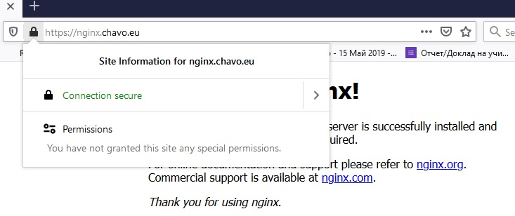

# NGINX setup to use HTTPS with trusted certificate

[Let's Encrypt](https://letsencrypt.org/) certificate using [`certbot`](https://certbot.eff.org/) and how to set-up this certificate in a nginx web server.

## Prerequisites

- AWS account with Secret and Access keys
- Registered Domain and access to control its DNS entries.

## Let's start

- Login to your AWS VM as root

```bash
ssh ubuntu@<the ip of the machine> 
sudo su -
```

## SSL certificate should be requested:

We will [Let's Encrypt](https://letsencrypt.org/) with [certbot](https://certbot.eff.org/) utility.

- If you are not register with Let's Encrypt. You must pass the interactive process after following command.
  
```bash
certbot register
```

If you have Let's Encrypt registration you could skip the above.

- Requesting a certificate.

I am using `DNS` validation process. Execute the following command

```bash
certbot certonly --manual --preferred-challenges dns -d nginx.chavo.eu
```

Follow the interactive process to validate your DNS record. It should be like following one:

```
$ certbot certonly --manual --preferred-challenges dns -d nginx.chavo.eu
Saving debug log to /var/log/letsencrypt/letsencrypt.log
Plugins selected: Authenticator manual, Installer None
Obtaining a new certificate
Performing the following challenges:
dns-01 challenge for nginx.chavo.eu

- - - - - - - - - - - - - - - - - - - - - - - - - - - - - - - - - - - - - - - -
NOTE: The IP of this machine will be publicly logged as having requested this
certificate. If you're running certbot in manual mode on a machine that is not
your server, please ensure you're okay with that.

Are you OK with your IP being logged?
- - - - - - - - - - - - - - - - - - - - - - - - - - - - - - - - - - - - - - - -
(Y)es/(N)o: Y

- - - - - - - - - - - - - - - - - - - - - - - - - - - - - - - - - - - - - - - -
Please deploy a DNS TXT record under the name
_acme-challenge.nginx.chavo.eu with the following value:

MaAi2ucQ2GErlRQv5KRT1f4vbG6VqhPMoTFgl9J9YSo

Before continuing, verify the record is deployed.
- - - - - - - - - - - - - - - - - - - - - - - - - - - - - - - - - - - - - - - -
Press Enter to Continue
```

I am using cloudflare, so it should be added as a `DNS TXT record under the name _acme-challenge.nginx.chavo.eu`

After validation the certificates and keys will be placed in `/etc/letsencrypt/archive/nginx.chavo.eu/`.

## Preparing NGINX to use the certificate over HTTPS

- Create nginx site config

```
vim /etc/nginx/sites-available/nginx.chavo.eu

server {
       listen 443 ssl;
        ssl_certificate      /etc/letsencrypt/archive/nginx.chavo.eu/cert1.pem;
        ssl_certificate_key  /etc/letsencrypt/archive/nginx.chavo.eu/privkey1.pem;

       server_name nginx.chavo.eu;

       root /var/www/html;
       index index.nginx-debian.html;

       location / {
               try_files $uri $uri/ =404;
       }
}
```

```bash
ln -s /etc/nginx/sites-available/nginx.chavo.eu /etc/nginx/sites-enabled/nginx.chavo.eu
systemctl reload nginx.service
```

## Check if the site can be accessed via HTTPS

To confirm if the site is available and secure, open your web browser `https://nginx.chavo.eu`, NGINX webpage should be available and the certificate should be valid:


